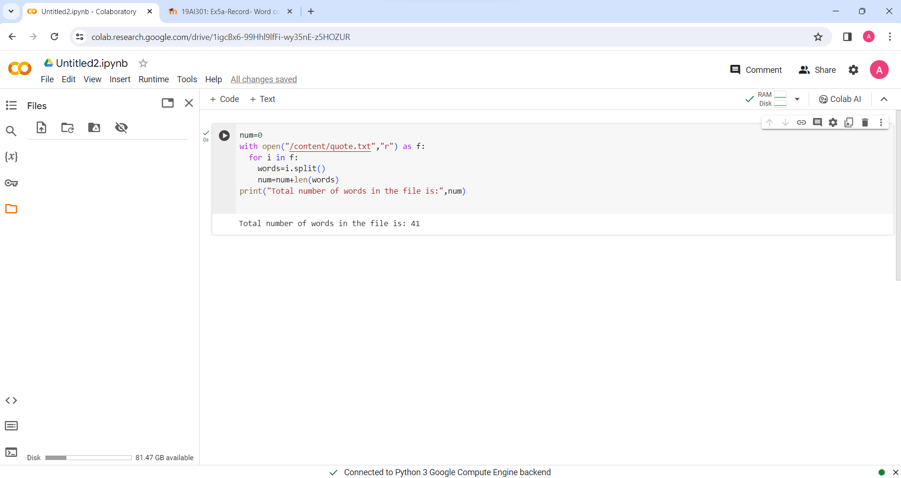

# Word-count

## AIM:

To write a python program for getting the word count from a text.

## EQUIPEMENT'S REQUIRED: 

1. PC

2. Anaconda - Python 3.7

## ALGORITHM: 

### Step 1:

Decleare number of words is 0

### Step 2:

Open it with txt file

### Step 3:

Give range for i

### Step 4:

Then next split the words

### Step 5:

count the number of words

### Step 6:

Giving print statement for getting output

## PROGRAM:
```
num=0
with open("/content/quote.txt","r") as f:
  for i in f:
    words=i.split()
    num=num+len(words)
print("Total number of words in the file is:",num)
```
### OUTPUT:


## RESULT:

Thus the program is written to find the word count from a text.
